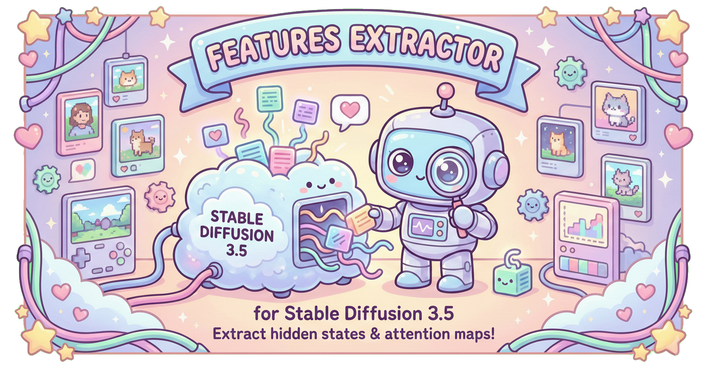

<div align="center">



# 🎨 Features Extractor for Stable Diffusion 3.5

[](https://www.python.org/)
[](https://pytorch.org/)
[](LICENSE)
[](https://stability.ai/)

*🔬 Extract internal features (hidden states and attention maps) from Stable Diffusion 3.5 models for analysis and research.*

</div>

---

This repository contains tools and scripts to extract internal features from Stable Diffusion 3.5 models. It is designed to facilitate analysis and experiments involving real and generated images.

## 📋 Prerequisites

Before using this code, you must set up the environment and download the necessary dependencies.

### 1️⃣ Clone with Submodules
The official Stable Diffusion 3.5 code is included as a **git submodule**.

```bash
git clone --recurse-submodules https://github.com/Duccioo/features-extractor-sd3.5.git
cd features-extractor-sd3.5
```

If you already cloned without `--recurse-submodules`:
```bash
git submodule update --init --recursive
```

### 2️⃣ Install

**Option A — pip install (recommended for reuse in other projects):**
```bash
pip install .
```
This installs the package as `sd35-feature-extractor` and provides the `sd35-extract` CLI command.

**Option B — editable install (for development):**
```bash
pip install -e .
```

**Option C — requirements only:**
```bash
pip install -r requirements.txt
```

- then install [pytorch](https://pytorch.org/get-started/locally/)

## ⚙️ Setup & Models

### 📥 Download Models
You need to download the Stable Diffusion 3.5 model weights (e.g., `sd3.5_large.safetensors`). A helper script is provided in the `src/download` folder.

Run the download script:
```bash
python src/download/download_models.py
```
*Note: This script uses Hugging Face. You may need to set up your Hugging Face token if the models require authentication.*

## 🚀 Usage

### 🔍 Feature Extraction
The main entry point for extracting features is `src/run_feature_extraction.py`. This script processes two directories of images (Real and Fake) and extracts features for analysis.

**Via CLI script (after pip install):**
```bash
sd35-extract \
    --model_path models/sd3.5_large.safetensors \
    --real_images_path path/to/real/images \
    --fake_images_path path/to/fake/images \
    --output_path output_features
```

**Or directly with Python:**
```bash
python src/run_feature_extraction.py \
    --model_path models/sd3.5_large.safetensors \
    --real_images_path path/to/real/images \
    --fake_images_path path/to/fake/images \
    --output_path output_features
```

**🔧 Key Arguments:**
-   `--model_path` **(required)**: Path to the downloaded model checkpoint (`.safetensors`).
-   `--real_images_path`: Folder containing the real images.
-   `--fake_images_path`: Folder containing the fake/generated images.
-   `--output_path`: Destination folder for extracted features.
-   `--seed`: Random seed for reproducibility (default: 69).
-   `--extract_attention`: Optional. Add this flag to extract attention maps (WARNING: uses significant disk space).
-   `--image_size`: Resolution to resize images (default: 512).
-   `--num_images`: Limit the number of images to process (-1 for all).
-   `--mean_pooling_only`: Optional. Apply spatial mean pooling to reduce feature size from `[1, seq_len, dim]` to `[1, dim]`, significantly reducing disk space usage.

**📦 Programmatic Usage (from another project):**
```python
from sd35_extractor.extract_features import extract_features

stats = extract_features(
    images_dir="path/to/images",
    output_dir="output_features",
    category="real",
    model_path="models/sd3.5_large.safetensors",
)
```

### 🛠️ Other Tools

#### 📝 Extract Text Embeddings
You can pre-compute text embeddings for use in conditioning:
```bash
python src/extract_text_embedding.py --model_path models/sd3.5_large.safetensors --output text_embeddings.pt
```

#### 📦 Download Datasets
The `src/download/` folder contains scripts to help you download various datasets used for training or testing, such as:
-   `download_genimage.py`
-   `download_echodataset.py`
-   `download_tiny_genimage.py`

## 📚 Documentation

For more detailed information on how the scripts work, please refer to the `docs/` folder:

-   [Feature Extraction Guide](docs/feature_extraction.md): Details on `run_feature_extraction.py` and output format.
-   [Text Embedding Guide](docs/text_embedding.md): How to pre-compute text embeddings.
-   [Download Scripts](docs/download_scripts.md): Information about model and dataset downloaders.
